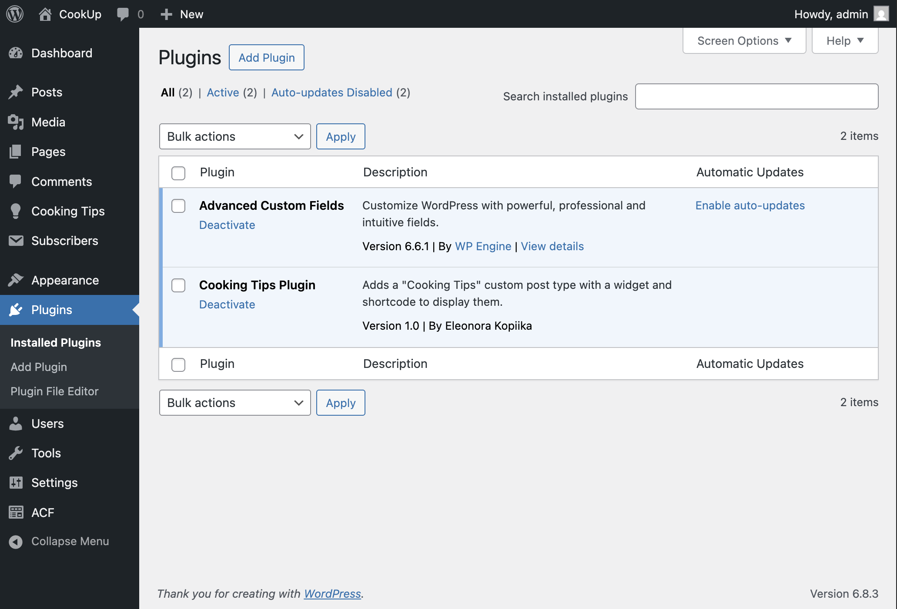
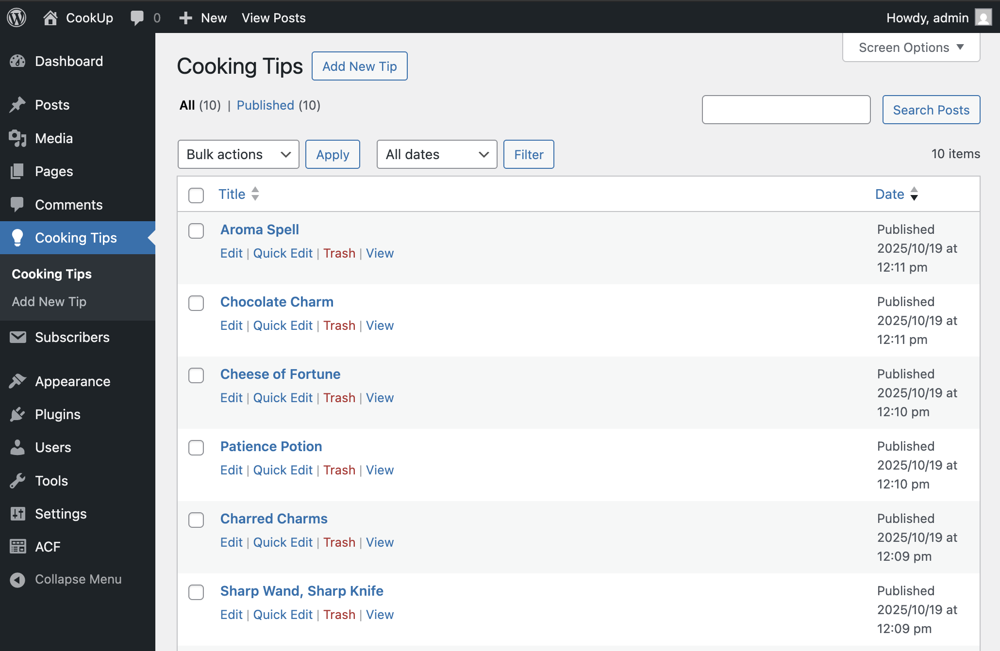
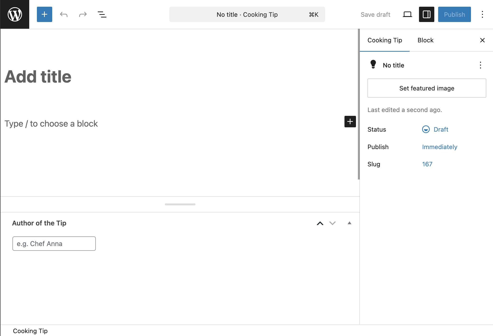
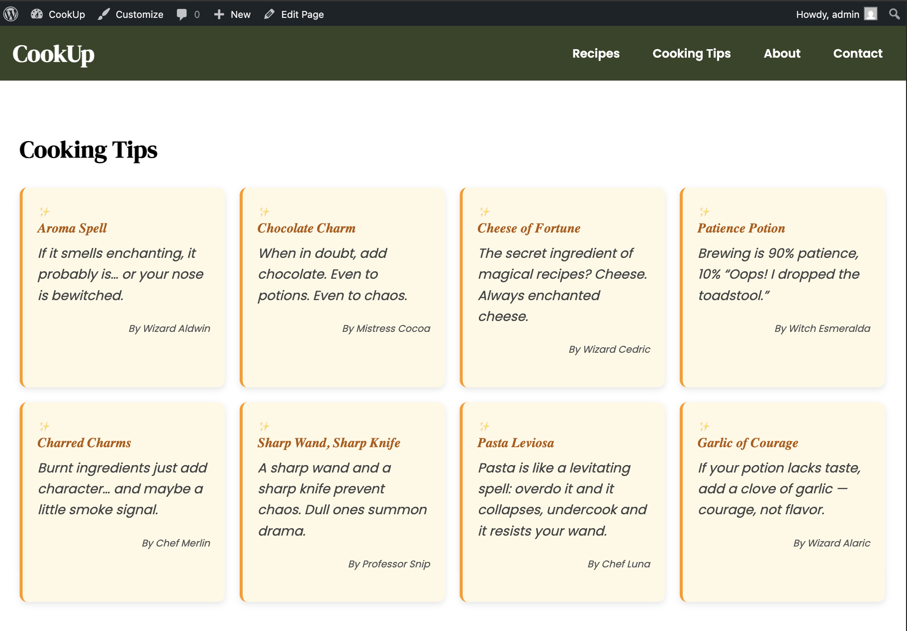
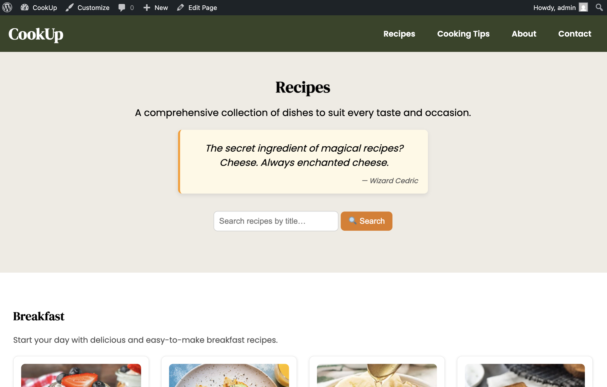
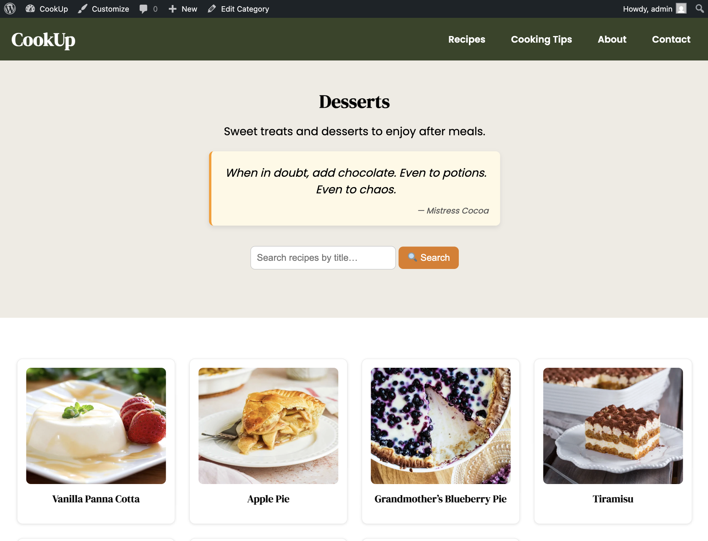

# Cooking Tips Plugin

**Contributors:** Eleonora Kopiika  
**Tested up to:** WordPress 6.8  
**Version:** 1.0  
**Description:** A plugin that adds magical Cooking Tips as a Custom Post Type, with a Widget and Shortcodes.  

---

## Features

- Custom Post Type **“Cooking Tips”**
- Custom meta field **“Author of the Tip”**
- Widget that displays random or recent tips
- Shortcodes `[cooking_tips count="8" type="latest"]` and `[cooking_tip_block]`

---

## Overview

This plugin adds:
- A **Custom Post Type** called `Cooking Tips` (for creating and managing tips in the admin area)
- A **Widget** (`Cooking Tips Widget`)
- Two **Shortcodes** for displaying tips on the site:
  - `[cooking_tips count="8" type="latest"]` – displays a grid of tips  
  - `[cooking_tip_block]` – displays a single random tip (used on the Recipes or Category pages)

---

## Custom Post Type

- `Cooking Tip` post type is registered in the plugin  
- Supports title, content, and a custom field `Tip Author`
- Accessible from the WordPress dashboard sidebar

---

## Widget

- Registered in the plugin as **“Cooking Tips Widget”**
- Displays a list of recent or random tips
- The current theme (*CookUp*) has **no sidebar**, so the widget area is not visible
- The widget works normally in any *widget-ready* theme

> “Widget is registered in the plugin (Cooking Tips Widget), but the current theme has no sidebar.  
> It can be used in any widget-ready theme.”

---

## 🧙 Shortcodes

| Shortcode | Description | Example |
|------------|--------------|----------|
| `[cooking_tips count="8" type="latest"]` | Displays a list of latest tips | Used on “Cooking Tips” page |
| `[cooking_tip_block]` | Displays a random tip | Used on Recipes and Category pages |

---

## 🧠 How It Works

- The plugin registers a **Custom Post Type** on activation.  
- Each tip can include:
  - Title (tip name)
  - Content (the tip itself)
  - Custom field: *Tip Author*  
- The `[cooking_tips]` shortcode queries multiple tips (latest or random)  
- The `[cooking_tip_block]` shortcode queries one random tip  
- The CSS styles (in `/css/style.css`) make the tips appear as decorative cards matching the CookUp theme

---

## 🖼️ Screenshots

- **Cooking Tips plugin** visible in Dashboard  
  

- **Cooking Tips CPT** visible in Dashboard  
  

- **Creating a new Cooking Tip**  
  

- **All tips page**  
  

- **Random tip block on Recipes page**  
  

- **Random tip block on Category page**  
  

---

## 🧾 Notes

- The plugin includes **CPT + Widget + Shortcodes**, fulfilling the project requirements.
- Widget is registered, but the **CookUp** theme has no sidebar, so it’s not visible under *Appearance → Widgets*.
- Two shortcodes demonstrate dynamic post display:
  - `[cooking_tips]` — for the full list (used on “Cooking Tips” page)
  - `[cooking_tip_block]` — for a single random tip (used on Recipes and Category pages)
- Custom CSS ensures visual consistency with the theme.

---

## 💾 Installation

1. Upload the `cooking-tips-plugin` folder to `/wp-content/plugins/`
2. Activate the plugin via **Dashboard → Plugins**
3. Go to **Cooking Tips** in the admin sidebar and add new tips
4. Add shortcode `[cooking_tips]` on the *Cooking Tips* page
5. Add `[cooking_tip_block]` on the *Category* or *Recipes* page

---

## 📁 Folder Structure

```bash
cooking-tips-plugin/
├─ css/
│ └─ style.css
├─ includes/
│ ├─ cpt.php
│ ├─ widget.php
│ └─ shortcode.php
├─ screenshots/
│ ├─ cooking-tips-plugin.png
│ ├─ cooking-tips.png
│ ├─ new-tip.png
│ ├─ cooking-tips-list.png
│ ├─ single-cooking-tip.png
│ └─ cooking-tip-category.png
├─ cooking-tips-plugin.php
└─ README.md
```

---

## 👩‍💻 Credits

Developed by **Eleonora Kopiika**  
No external plugins used (except ACF for the main theme).  
All code for this plugin is original and created for the project.  

