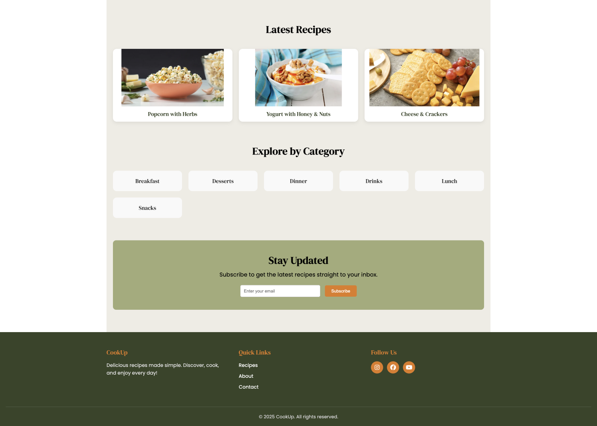
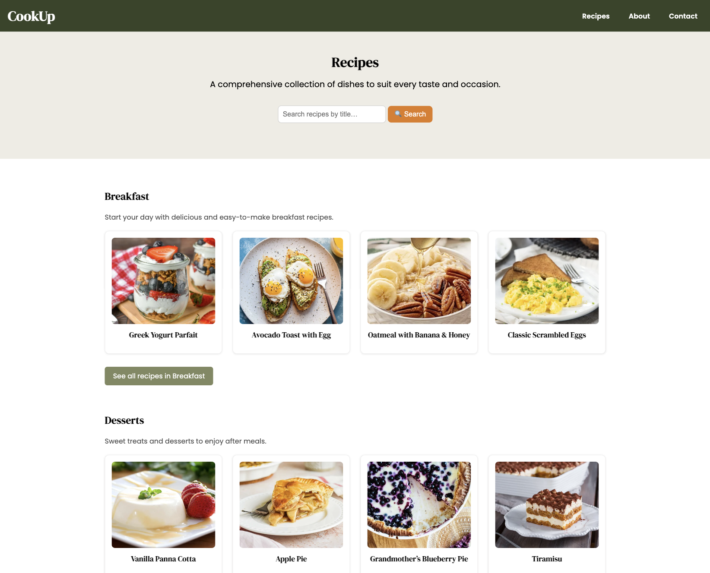
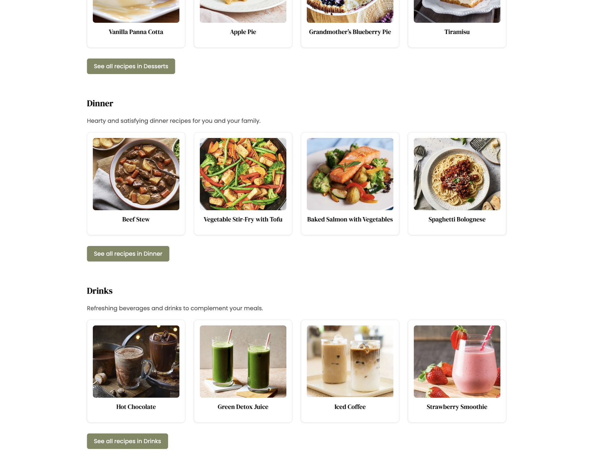
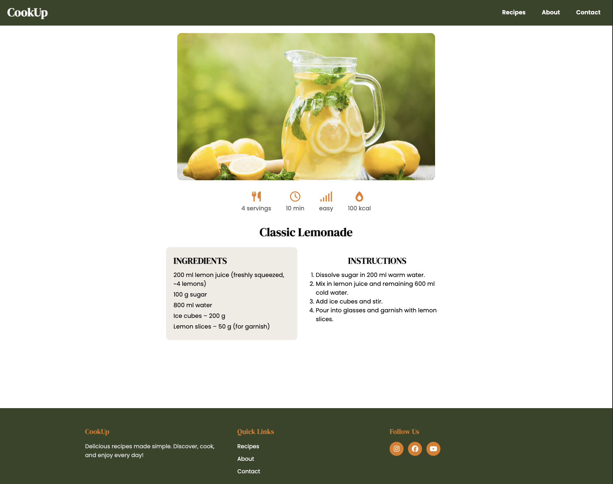
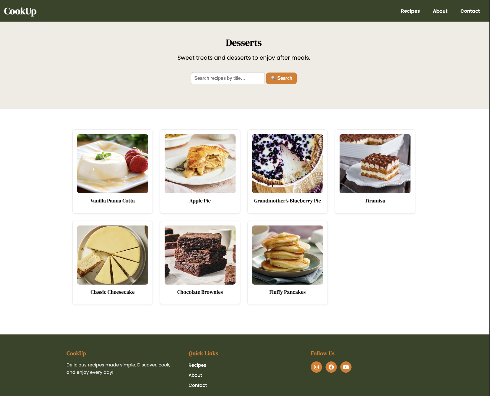
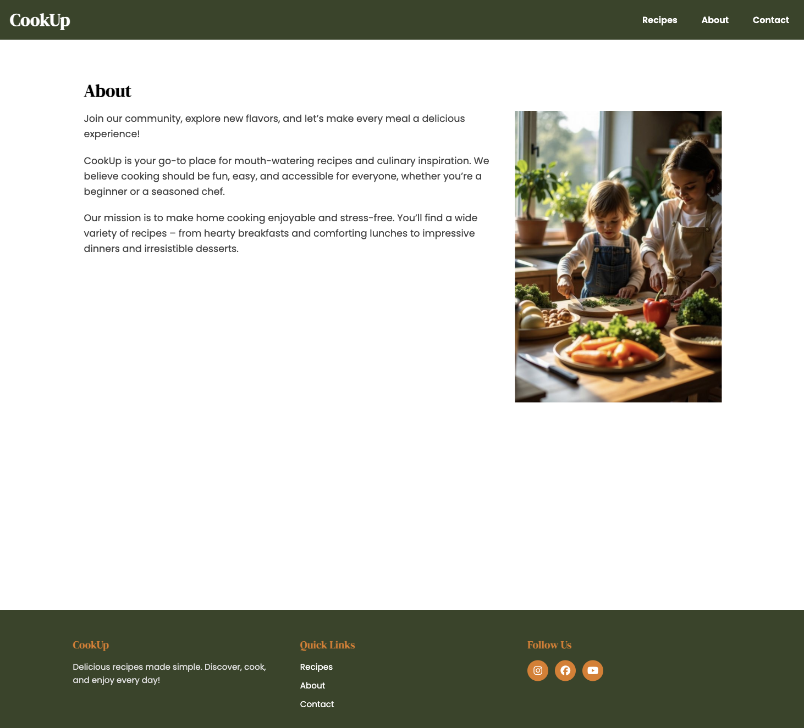
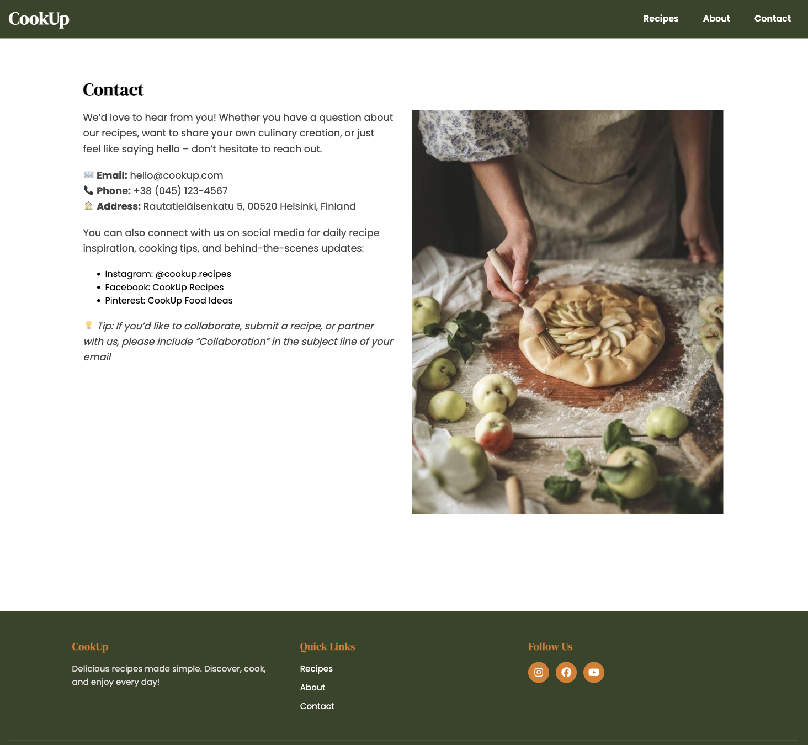
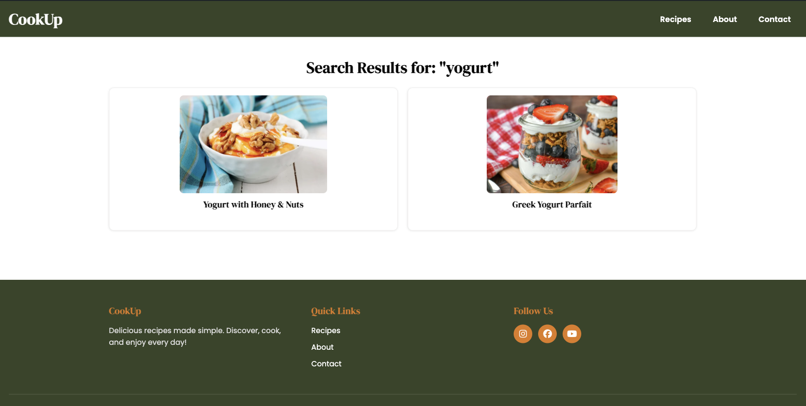

# CookUp Theme

CookUp Theme is a custom WordPress theme for a recipe website.

---

## 🖼 Screenshots

### Front Page




### Recipes Page






### Single Recipe Page



### Category Page



### About Page



### Contact Page



### Search Results Page



---

## 📄 Page Overview

1. **Front Page (front-page.php)**

   - Hero image with site name and short description: _“Discover easy and tasty meals for every day”_
   - Call-to-action button: **View Recipes**
   - "Latest Recipes" section (last 3 posts)
   - Block with all categories (links to categories: breakfast, lunch, desserts...)
   - Newsletter signup field (Custom Post Type `subscriber`), duplicate emails are prevented

2. **All Recipes Page (page-recipes.php)**

   - Search field for recipes by title
   - Display last 4 recipes for each category
   - "See all recipes in (category name)" button

3. **Category Page**

   - List of all recipes in the category
   - Search by title restricted to this category

4. **Single Recipe (single.php)**

   - Recipe image
   - Icons via Font Awesome
   - Recipe details using custom fields (ACF free version): servings, cooking time, difficulty, calories, ingredients, instructions
   - Future plan: search by recipe ingredients

5. **Search Results Page**

   - Displays posts matching the search query
   - Shows recipe titles, images, and excerpts
   - Allows users to quickly find relevant recipes

6. **About and Contact Pages**

   - **About:** Information about the website and the author
   - **Contact:** Contact details for users to get in touch

7. **Header**

   - Logo linking to the homepage
   - Menu with dropdown submenus (also mobile version)
   - Favicon support

8. **Footer**

   - Site logo
   - Quick Links: Recipes, About, Contact
   - Follow Us links (YouTube, Instagram, Facebook)
   - Copyright © 2025 CookUp

---

## 📂 Theme Files

```bash
cookup-theme/
├─ images/
│ ├─ hero.webp
│ ├─ favicon.png
│ └─ screenshots/
│ ├─ front-page.png
│ ├─ recipes-page.png
│ ├─ single-recipe.png
│ ├─ category-page.png
│ ├─ about-page.png
│ └─ contact-page.png
├─ js/
│ └─ cookup.js
├─ archive.php
├─ category.php
├─ footer.php
├─ front-page.php
├─ functions.php
├─ header.php
├─ index.php
├─ single.php
├─ page-recipes.php
├─ page.php
├─ search.php
├─ searchform.php
├─ style.css
└─ README.md
```

---

## 📝 Installation

1. Upload the `cookup-theme` folder to `/wp-content/themes/`
2. Activate the theme via WordPress admin panel.
3. Add categories, recipes, and content via the WordPress admin
4. Install **ACF (Advanced Custom Fields)** free plugin for recipe custom fields.

---

## Theme Features (extended):

- Custom Post Type "Subscriber" – for managing newsletter sign-ups.

- Search filter limited to posts on the Recipes page template.

- Category-based recipe display – recipes grouped and displayed by category with description and preview grid.

- Font Awesome integration – icons for styling.

---

## Notes

No third-party plugins (other than ACF for custom fields) were used for main features.

All custom PHP and CSS code was written independently.

External tutorials and documentation were used only as references for learning.
This README describes the current state of the CookUp Theme and demonstrates its main features and file structure.
